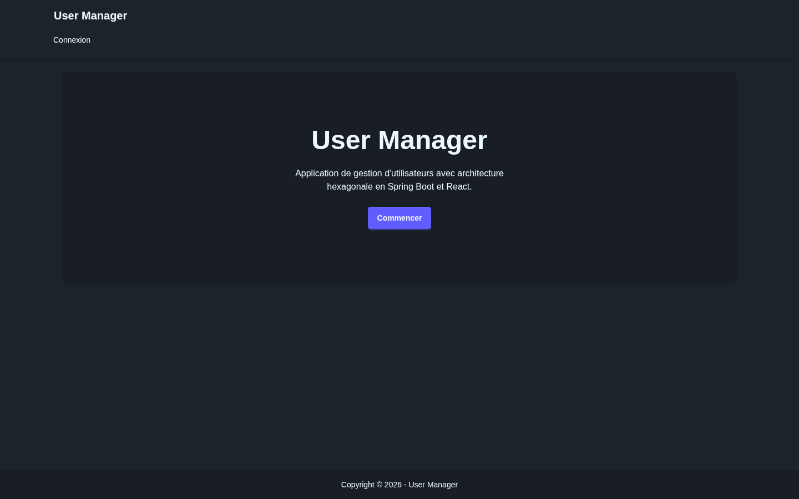
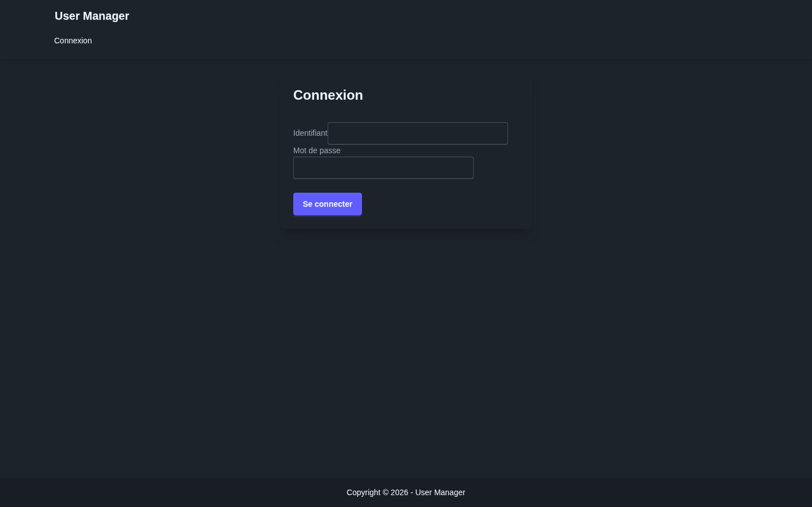
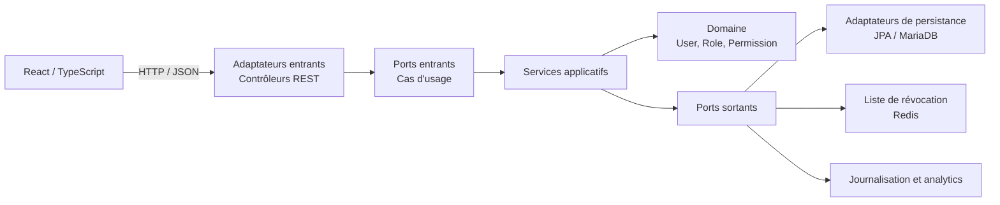

# User Manager

[](https://dl.circleci.com/status-badge/redirect/gh/lpreaux/usermanager/tree/main)

Application de gestion d'utilisateurs et de rôles. Le projet associe une API Spring Boot organisée en architecture hexagonale à une interface React/TypeScript.

> [!IMPORTANT]
> Les anciens fichiers d'environnement ont été retirés du dépôt. Toute valeur qui y a figuré doit être considérée comme compromise, rotatée, puis supprimée de l'historique Git. Ne placez jamais de secret réel dans un fichier versionné.

## Fonctionnalités

- authentification avec jetons JWT/JWE et révocation via Redis ;
- gestion des utilisateurs, coordonnées, mots de passe, rôles et permissions ;
- protection contre les tentatives de connexion répétées et journalisation d'audit ;
- API documentée avec OpenAPI, métriques Actuator/Prometheus et migrations Flyway ;
- interface React avec formulaires validés, cache TanStack Query et état Zustand.

## Aperçu

| Accueil | Connexion |
| --- | --- |
|  |  |

## Architecture



- `domain` contient les entités et objets-valeur, sans dépendance vers l'infrastructure.
- `application/port/in` définit les cas d'usage exposés par l'application.
- `application/port/out` définit ce dont les services ont besoin pour persister, signer ou auditer.
- `infrastructure/adapter/in` traduit HTTP vers les ports entrants.
- `infrastructure/persistence` et les autres adaptateurs sortants implémentent les ports vers JPA, Redis et les services d'observabilité.

## Stack technique

| Zone | Technologies |
| --- | --- |
| Backend | Java 23, Spring Boot 3.4, Spring Security, Spring Data JPA, Flyway |
| Données | MariaDB, Redis |
| Frontend | React 19, TypeScript, Vite, Tailwind CSS, daisyUI |
| Qualité | JUnit 5, JaCoCo, ESLint, TypeScript, CircleCI, Codecov |
| Exécution | Docker, Docker Compose, Nginx |

## Lancement local

Prérequis : Docker avec Compose, Node.js 22+ et pnpm.

```bash
cp .env.example .env
# Remplacer les valeurs change-me avant de démarrer les services.
docker compose up --build
```

L'API répond sur <http://localhost:8080>, Swagger UI sur <http://localhost:8080/swagger-ui/index.html> et Adminer sur <http://localhost:8081>.

Dans un second terminal :

```bash
cd frontend
corepack enable
pnpm install --frozen-lockfile
pnpm dev
```

L'interface est disponible sur <http://localhost:3000> et Vite transmet les appels `/api` au backend local.

## Tests et contrôles

```bash
# Backend
cd backend
./mvnw clean verify -Dspring.profiles.active=test

# Frontend
cd frontend
pnpm lint
pnpm build
```

La CI exécute ces contrôles pour chaque branche. Le rapport JaCoCo est ensuite transmis à Codecov.

## Configuration

`.env.example` documente les variables attendues avec des valeurs factices. Les intégrations Sentry et PostHog sont désactivées par défaut ; renseignez-les uniquement dans votre gestionnaire de secrets ou dans un fichier `.env` local ignoré par Git.

Les profils de production ajoutent Nginx, les sauvegardes MariaDB et les réglages de supervision décrits dans [`docs/MONITORING.md`](docs/MONITORING.md).
